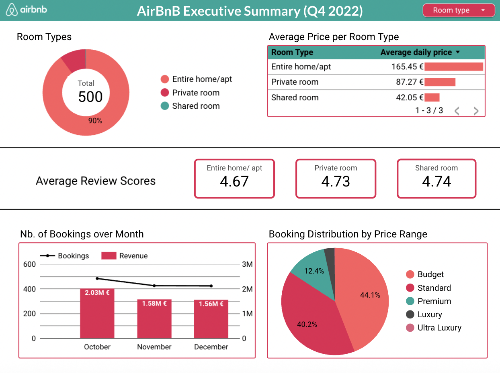

# 🏠 Airbnb Paris 🎡 – Q4 2022 Business Analysis

## 🎯 Business Problem

Airbnb Paris listings generated **€5.17M in Q4 2022** but captured only **72% of its total revenue potential (€7.20M)**.

This project investigates:
	•	Where revenue leakage occurs
	•	How pricing tiers impact occupancy
	•	Whether host behavior influences booking performance
	•	What actions could improve revenue capture

The objective is to provide actionable recommendations for optimizing listing performance and revenue efficiency.

---

## 🔹 Executive Summary  
Airbnb Paris in Q4 2022 achieved strong booking activity but underperformed in revenue capture, with only **72% of potential revenue realized**. This project explores how pricing, marketing, and guest satisfaction impact occupancy, conversion, and revenue. The analysis delivers actionable insights for hosts to optimize their listings, pricing, and guest experience.

---

## 🔹 Data Sources

- Source: **Airbnb Open Data** (Paris listings & calendar, Q4 2022)  
- Access datasets:  
  - [Airbnb Listings Dataset](http://console.cloud.google.com/bigquery?ws=!1m5!1m4!4m3!1sdata-analytics-bootcamp-363212!2sairbnb!3slisting) (host, property, price, location, amenities, reviews)
  - [Airbnb Calendar Dataset](http://console.cloud.google.com/bigquery?ws=!1m5!1m4!4m3!1sdata-analytics-bootcamp-363212!2sairbnb!3scalendar) (daily availability, booked/unbooked days, prices)

---

## 🔹 Data Preparation & Transformation (SQL – BigQuery)
- Removed duplicates and standardized text formats
- Corrected missing or inconsistent values
- Converted price and availability columns to numerical formats
- Joined listings and calendar datasets
- Created derived performance metrics

Feature engineering included:
- Occupancy rate
- Revenue potential
- Lost revenue
- Price tier segmentation (Budget, Standard, Premium, Luxury, Ultra Luxury)

The final structured dataset was stored in **BigQuery** and visualized in **Looker Studio**.

---

## 📈 KPI Framework

To evaluate listing efficiency and revenue performance, the following core metrics were defined:
- **Revenue** = Booked Days × Price
- **Revenue Potential** = Available Days × Price
- **Revenue Capture Rate** = Revenue / Revenue Potential
- **Occupancy Rate** = Booked Days / Available Days
- **Lost Revenue** = Unbooked Days × Listed Price

This framework allows direct comparison between realized revenue and maximum achievable revenue.

---

## 🔹 Revenue & Pricing Insights

Revenue Capture
- Total Q4 revenue: **€5.17M**
- Revenue potential: **€7.20M**
- Revenue capture rate: **72%**

Lost revenue increased steadily across the quarter:
- October: ~€418K
- November: ~€756K
- December: ~€906K

This represents a **117% increase from October to December**, coinciding with a decline in occupancy.

This pattern may indicate:
- Price resistance in higher tiers
- Demand seasonality effects in late Q4
- Suboptimal dynamic pricing adjustments

---

## 🔹 Price Tier Performance

Listings were segmented into five price tiers:
- Budget (≤100€)
- Standard (101–200€)
- Premium (201–400€)
- Luxury (401–1000€)
- Ultra Luxury (>1000€)

Key observations:
- Budget and Standard tiers achieved the strongest occupancy levels.
- Premium listings showed weaker occupancy relative to price.
- Luxury and Ultra Luxury listings maintained competitive review scores but limited volume.

This suggests potential pricing elasticity in the Premium segment.

---

## 🔹 Guest Satisfaction & Operational Impact

**Review Scores by Room Type**
- Entire home/apt: 4.67
- Private room: 4.73
- Shared room: 4.74

**Host Response Time Impact**

Listings with slower response times (“a few days or more”) showed:
- Lower average review scores
- Lower booking volumes

This indicates that operational responsiveness may directly influence booking performance and revenue generation.

---

## 🔹 Dashboard

**📊 Explore the interactive dashboard:**

**[Airbnb Paris – Q4 2022 Business Dashboard](https://lookerstudio.google.com/reporting/9140899d-54a4-4806-b827-503bb171a327)**

---

## 🔹 Tools & Technologies
- SQL (BigQuery) → Data cleaning, transformations, feature engineering
- Looker Studio → Interactive dashboard & KPI reporting

📂 SQL scripts available in the /sql folder.

---

## 🔹 Final Recommendations
- Implement dynamic pricing strategies for underperforming Premium listings
- Reduce booking gaps by analyzing price-to-occupancy relationships
- Improve host response times to enhance ratings and conversion
- Monitor revenue capture rate monthly to detect early leakage

---

## 🔮 Future Improvements
- Incorporate historical data to analyze seasonality (YoY comparison)
- Calculate RevPAR and ADR benchmarks
- Model price elasticity per segment
- Build predictive model for booking probability

---

## 👩‍💻 Project Context

This project was developed as part of a Data Analytics Bootcamp at Le Wagon.

The focus was on:
- Designing a structured KPI framework
- Building a revenue performance model
- Delivering business-oriented insights
- Creating an executive-facing dashboard
